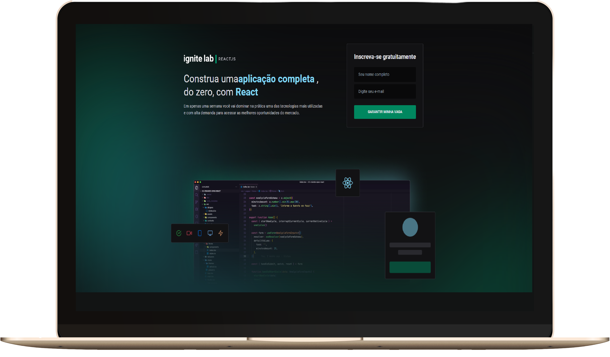

<h1 align="center">
  
</h1>

<h3 align="center">
  Online platform for events/classes with the community
</h3>

<br><br>

<p align="center">
  <a href="#-about-the-project">About the project</a> •
  <a href="#-technologies">Technologies</a> •
  <a href="#-getting-started">Getting started</a> •
  <a href="#-license">License</a>
</p>

<p align="center">
  
</p>

## 👩‍💻 About the project

Event-Platform is a project created at the Ignite Lab event, hosted by [Rocketseat](https://rocketseat.com.br/)

Project integrated with GraphCMS, where you can publish the classes for the community to watch on the event's website!

[click here, see closer](https://event-platform-cs.vercel.app/) 😉

## 🚀 Technologies

- [ReactJS](https://reactjs.org/)
- [TypeScript](https://www.typescriptlang.org/)
- [Graphcms](https://graphcms.com/)
- [GraphQl](https://graphql.org/)
- [Tailwindcss](https://tailwindcss.com/)

## 💻 Getting started

### Requirements

- [Node.js](https://nodejs.org/en/)
- [Yarn](https://classic.yarnpkg.com/) or [NPM](https://www.npmjs.com/) _(examples are with yarn)_

**Clone the project and access the folder**

```bash
$ git clone https://github.com/leandrorodrigues00/event-platform && cd event-platform

```

**Follow the steps below**

```bash
# Install the dependencies
$ yarn

# Make a copy of '.env.example' to '.env'
# and set with YOUR environment variables.
$ cp .env.example .env

# Start the app
$ yarn dev
```

## 📝 License

This project is licensed under the MIT License - see the [LICENSE](LICENSE) file for details.

---

<p align="center">
  Made with 💜&nbsp; by  Leandro Rodrigues
</p>
